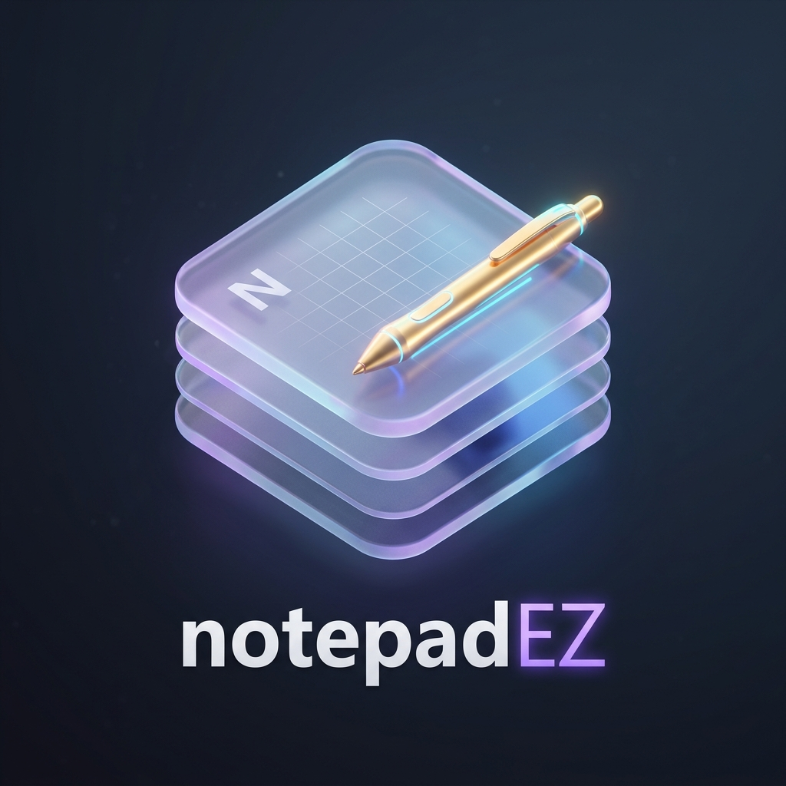

# notepadEZ 📝

> A modern, sleek, Windows 11 Fluent-inspired desktop & web notepad built with **React**, **TypeScript**, **Tailwind CSS**, **Vite**, and **Electron**.



---

## ✨ Features

- 🎨 **Windows 11 Fluent UI Design**: Modern rounded tabs, top accent indicators, frosted glass panel blur, and sleek dark/light acrylic themes.
- ✍️ **Pure Rich Text & WYSIWYG Editor**: Write naturally with direct visual formatting (**Bold**, _Italic_, Headings, Bullet & Numbered Lists, Code Blocks, Blockquotes, Tables, Checklists). No raw markdown syntax tags (`**`, `#`, `*`) clutered on screen.
- 📋 **Smart Markdown Paste Auto-Conversion**: Automatically transforms pasted markdown text (from ChatGPT, GitHub, or documentation) into clean formatted HTML elements instantly.
- 🖥️ **Pure Edge-to-Edge Full Screen Mode**: Distraction-free writing canvas toggled via **`F11`** or **`Ctrl+Shift+F`** with zero header clutter.
- 💾 **Real-time Auto-Save & Session Restoration**: Automatically saves all notes, active tab state, and open note tabs in real-time. Reopen the app anytime without losing drafts.
- 📁 **Multi-Format Export & Native Save**: Switch between **`.txt`** (Text Document), **`.md`** (Markdown File), **`.html`** (Web Page), **`.json`** (JSON Data), and **`.csv`** (Spreadsheet) directly from the header or status bar.
- 🔍 **In-Editor Find & Replace**: Live match counter, previous/next match navigation, case matching, and replace single/all (`Ctrl+F` / `Ctrl+H`).
- 🕒 **Revision History Snapshots**: Automatic character diff metrics and 1-click timeline snapshot restoration.
- 🔗 **Clickable Web Links & Windows 11 Link Modal**: Replaced browser popups with a sleek frosted glass link insertion modal (`LinkInsertModal`). Click any link inside your notes to open it in a new browser tab.
- 📊 **Real-time Document Analytics**: Live word count, character count, line count, and estimated reading time.

---

## 🚀 Getting Started

### Prerequisites

Ensure you have the following installed on your system:

- **Node.js**: `v18.0.0` or higher ([Download Node.js](https://nodejs.org/))
- **npm**: `v9.0.0` or higher (comes with Node.js)

### ⚡ Quick Install (Windows PowerShell)

Run this single command in **PowerShell** to automatically download and install the latest desktop version of **notepadEZ**:

```powershell
irm https://raw.githubusercontent.com/reinieltalplacido/notepadEZ/main/install.ps1 | iex
```

---

### 📥 Manual & Development Setup

1. **Clone the Repository**:

   ```bash
   git clone https://github.com/reinieltalplacido/notepadEZ.git
   cd notepadEZ
   ```

2. **Install Dependencies**:

   ```bash
   npm install
   ```

3. **Run in Development Mode (Web)**:

   ```bash
   npm run dev
   ```

   Open your browser at `http://localhost:5173`.

4. **Run Desktop App (Electron Development)**:
   ```bash
   npm run electron:dev
   ```

---

## 🛠️ Building & Packaging

### Build Web Application

```bash
npm run build
```

### Package Desktop App (Windows / macOS / Linux)

```bash
npm run build:electron
```

The compiled binaries will be output to the `release/` directory.

---

## 🤝 How to Contribute

Contributions, issues, and feature requests are welcome! Feel free to check out the [issues page](https://github.com/reinieltalplacido/notepadEZ/issues).

### Contribution Steps

1. **Fork the Repository**:
   Click the **Fork** button at the top right of the [notepadEZ GitHub page](https://github.com/reinieltalplacido/notepadEZ).

2. **Create a Feature Branch**:

   ```bash
   git checkout -b feature/amazing-feature
   ```

3. **Make & Verify your Changes**:
   Ensure all TypeScript checks pass cleanly:

   ```bash
   npx tsc -b
   ```

4. **Commit your Changes**:

   ```bash
   git commit -m 'feat: Add some amazing feature'
   ```

5. **Push to the Branch**:

   ```bash
   git push origin feature/amazing-feature
   ```

6. **Open a Pull Request**:
   Navigate to the original repository and click **New Pull Request**. Describe your changes and submit for review.

---

## 📄 License

This project is licensed under the [MIT License](LICENSE).

---

## 👨‍💻 Author

Created with ❤️ by **Reiniel Talplacido**

- GitHub: [@reinieltalplacido](https://github.com/reinieltalplacido)
